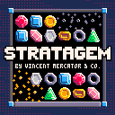

# _Stratagem_: A Nonlinear Match-3 Game for the PICO-8

<div align="center">

</div>

_Stratagem_ is a match-3 game for the
[PICO-8 fantasy console](https://www.lexaloffle.com/pico-8.php). The objective
of the game is to get as many points as possible by swapping adjacent gems on a
grid to clear touching groups on the grid. Spend your chances to make wrong
non-matching moves wisely; once you run out, it's game over!

## Build Instructions

The included Makefile automatically downloads and installs
[`picotool`](https://www.dansanderson.com/projects/picotool/) for assembling and
modifying the PICO-8 cartridge's parts. You can run the following script to
download and run _Stratagem_ on your machine (assuming the PICO-8 executable is
on your PATH).

```bash
git clone github.com/vm70/stratagem
cd stratagem
make
```

## Contributing

Contributions are welcome. If you find a bug or would like to request a feature,
please report it through Stratagem's
[issues](https://github.com/vm70/stratagem/issues) page on its GitHub
repository. For more information, see `CONTRIBUTING.md`.

Contributors:

- Vincent "VM" Mercator ([@vm70](https://github.com/vm70/)): Lead
  Developer/Artist/Musician
- MattSquare ([@squaremango](https://github.com/squaremango)): Gem Sprite Artist
- [Bejeweled Fans Discord](https://discord.com/servers/bejeweled-fans-328339420900098048)
  Members: Playtesters & Feature Requesters

...and players like you. Thank you!

## Special Thanks

- [Cameron](https://cmrn.io/)
  ([@spriterights](https://www.lexaloffle.com/bbs/?uid=18643),
  [@z6v](https://x.com/z6v)), creator of
  [_Match-3_](https://www.lexaloffle.com/bbs/?pid=42523)
- [@Grumpydev](https://www.lexaloffle.com/bbs/?uid=31046), creator of
  [_Persistent High Score Table Demo_](https://www.lexaloffle.com/bbs/?tid=31901)
- Jason Kapalka & Heather Hazen, original creators of _Bejeweled_
- [Dan Sanderson](https://www.dansanderson.com/), creator of `pico-tool`
- Brook ([@gamedevbrook](https://twitter.com/gamedevbrook),
  [@brook.p8](https://itch.io/profile/gamedevbrook)), creator of
  [_Pushamo_](https://gamedevbrook.itch.io/pushamo)

## License

> Copyright © 2019-2024 Vincent Mercator
>
> This program is free software: you can redistribute it and/or modify it under
> the terms of the GNU General Public License as published by the Free Software
> Foundation, either version 3 of the License, or (at your option) any later
> version.
>
> This program is distributed in the hope that it will be useful, but WITHOUT
> ANY WARRANTY; without even the implied warranty of MERCHANTABILITY or FITNESS
> FOR A PARTICULAR PURPOSE. See the GNU General Public License for more details.
>
> You should have received a copy of the GNU General Public License along with
> this program. If not, see <http://www.gnu.org/licenses/>.
