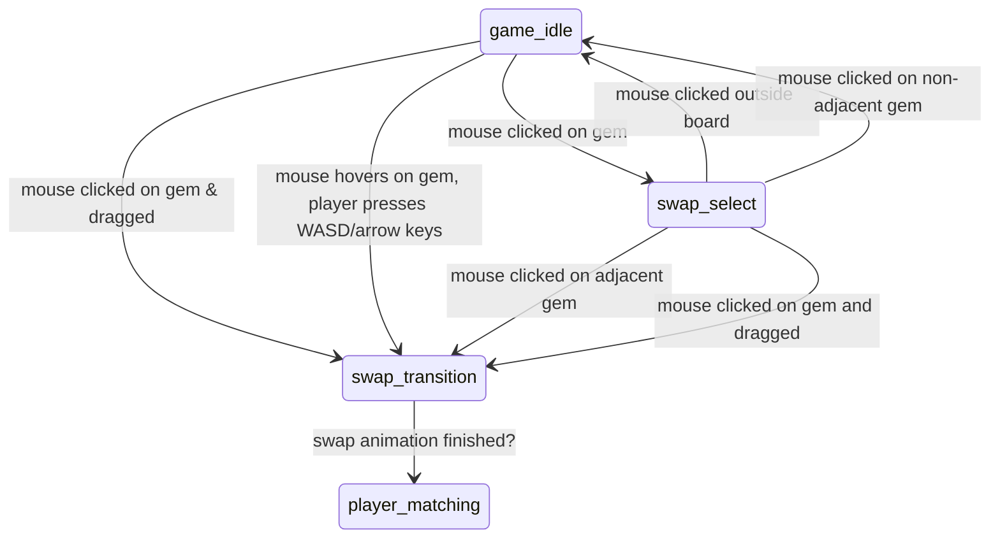

# Mouse Controls

These are the plans for mouse controls.

```mermaid
stateDiagram-v2
  game_idle --> swap_select: mouse clicked on gem
  game_idle --> swap_transition: mouse clicked on gem & dragged
  game_idle --> swap_transition: mouse hovers on gem, player presses WASD/arrow keys

  swap_select --> swap_transition: mouse clicked on adjacent gem
  swap_select --> swap_transition: mouse clicked on gem and dragged
  swap_select --> game_idle: mouse clicked outside board
  swap_select --> game_idle: mouse clicked on non-adjacent gem

  swap_transition --> player_matching: swap animation finished?
```
