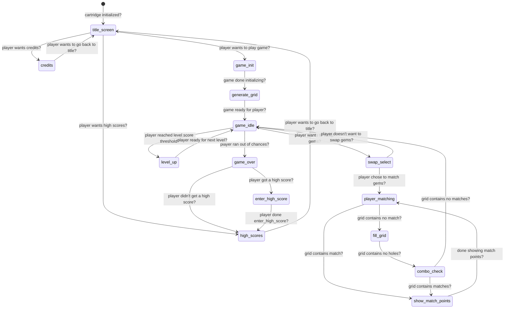

# State Diagram

Here is the current implementation of Stratagem's state diagram.

```mermaid
stateDiagram-v2
  [*] --> title_screen: cartridge initialized?

  title_screen --> credits: player wants credits?
  title_screen --> high_scores: player wants high scores?
  title_screen --> game_init: player wants to play game?

  credits --> title_screen: player wants to go back to title?

  game_init --> generate_grid: game done initializing?

  generate_grid --> game_idle: game ready for player?

  game_idle --> swap_select: player wants to swap gems?
  game_idle --> level_up: player reached level score threshold?
  game_idle --> game_over: player ran out of chances?

  swap_select --> game_idle: player doesn't want to swap gems?
  swap_select --> player_matching: player chose to match gems?

  player_matching --> show_match_points: grid contains match?
  player_matching --> fill_grid: grid contains no match?

  show_match_points --> player_matching: done showing match points?

  fill_grid --> combo_check: grid contains no holes?

  combo_check --> show_match_points: grid contains matches?
  combo_check --> game_idle: grid contains no matches?

  level_up --> game_idle: player ready for next level?

  game_over --> enter_high_score: player got a high score?
  game_over --> high_scores: player didn't get a high score?

  enter_high_score --> high_scores: player done enter_high_score?

  high_scores --> title_screen: player wants to go back to title?
```
